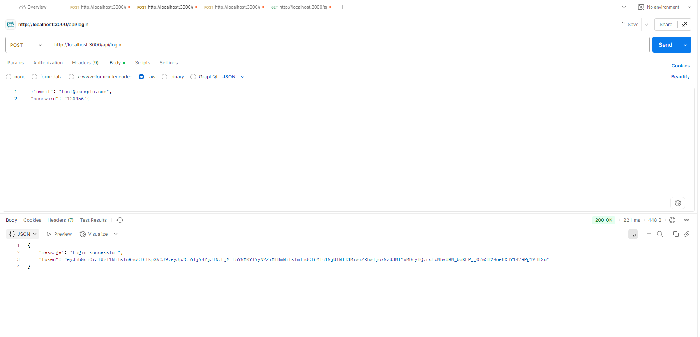

🔐 Per-User Encrypted File Service

A secure Node.js backend that allows users to upload, encrypt, download, and manage files.
Each file is encrypted per user, ensuring privacy and security.

🚀 Features

User authentication with JWT & bcrypt

File upload with Multer

Supports multiple file types (PDF, Images, Audio, Video, etc.)

Per-user encryption (AES) for uploaded files

Secure file download with automatic decryption

MongoDB integration for user and file metadata

Input validation and middleware protection

🛠️ Tech Stack

Node.js + Express.js

MongoDB (Mongoose ODM)

Multer (file uploads)

Crypto (encryption/decryption)

JWT (authentication)

bcrypt (password hashing)

📂 Project Structure

src/
 ├── config/          # Database connection
 ├── controllers/     # Auth & file logic
 ├── middleware/      # Auth & multer configs
 ├── models/          # Mongoose schemas
 ├── routes/          # API endpoints
 ├── utils/           # Encryption/Decryption helpers
 └── server.js        # App entry point

 ⚙️ Setup & Installation

Clone the repo
git clone https://github.com/your-username/Per-User-Encrypted-For-All-Service.git
cd Per-User-Encrypted-For-All-Service

Install dependencies
npm install

Configure environment variables
Create a .env file in the root:
PORT=3000
MONGO_URI=your_mongodb_connection_string
JWT_SECRET=your_jwt_secret

Run the server
node src/server.js
Server should start on http://localhost:3000

🧪 API Testing (with Postman)

1. Register a new user
POST /register
Content-Type: application/json

{
    "username": "test"
  "email": "test@example.com",
  "password": "123456"
}
✅ Expected Response:

{
  "message": "User registered successfully"
}

2. Login to get JWT token
POST /login
Content-Type: application/json

{
  "email": "test@example.com",
  "password": "123456"
}

✅ Expected Response:

{
  "token": "<your-jwt-token>"
}

3. Upload a file
POST /fileupload
Authorization: Bearer <JWT_TOKEN>
Content-Type: multipart/form-data
file: <choose a file>

✅ Expected Response:

{
  "message": "File uploaded and encrypted successfully",
  "fileId": "64f2b3a7c2..."
}

4. Download a file
GET /downfile/:fileId
Authorization: Bearer <JWT_TOKEN>

✅ Expected Result:

The encrypted file will be decrypted automatically and downloaded.

📸 Example Postman Screenshots

➡️ Register User

➡️ Login

➡️ Upload File

➡️ Download File

📌 Future Improvements

Add frontend UI for easier usage

Support cloud storage (S3, Google Cloud)

Add rate-limiting & audit logs

